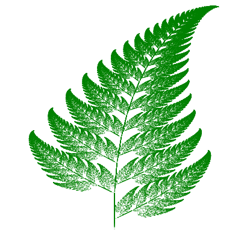
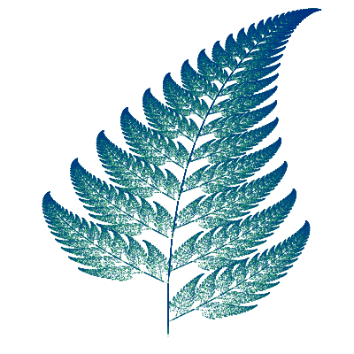

# potential-art

Some drawings made using [Luxor.jl](https://github.com/JuliaGraphics/Luxor.jl/).

All of the examples are [Pluto.jl notebooks](https://github.com/fonsp/Pluto.jl/), some of them have interactive sliders for you to play around with.

These creations only touch the surface of what's possible using Luxor, check out the [Luxor documentation](http://juliagraphics.github.io/Luxor.jl/stable/examples/) for more examples

# Showcase

## [Barnsley's Fern](./src/barnsley_fern.jl)

[Barnsley's fern](https://en.wikipedia.org/wiki/Barnsley_fern) is a fractal that looks like a fern. It only takes a few lines of code to generate this. (logic/algo borrowed from the python example on the Wikipedia article linked above)

## [Boing](./src/boing.jl)

A beautiful animation of what looks like a rotating square changing colors and leaving behind a trail. The design was borrowed from the first example for Turtle in the [documentation](http://juliagraphics.github.io/Luxor.jl/stable/turtle/). The name does not make any sense I know.

## [Colored circles](./src/color_circles.jl) (and [more colored circles](./src/more_color_circles.jl))

Some circles inside other circles and they are colored. Very creative name

# Why?

Because I was bored and I found an old TODO note from my past self asking me to try making Barnsley's fern in python. I used Julia instead. I liked Luxor and Pluto so much that I wanted to play around more.

# License

MIT License because why not.
